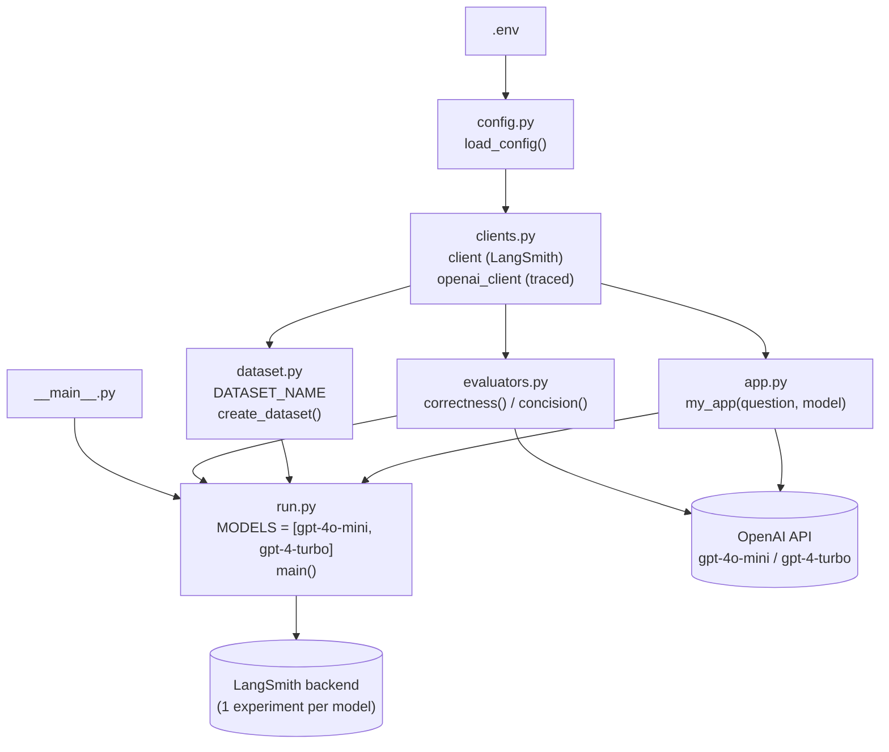
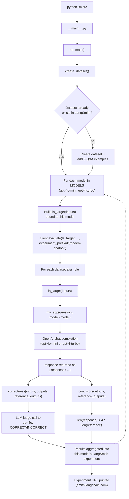

# langsmith-chatbot-eval

A small evaluation harness that scores a simple OpenAI-powered chatbot using [LangSmith](https://smith.langchain.com/)'s evaluation framework — an LLM-as-judge **correctness** check and a rule-based **concision** check, run against a fixed Q&A dataset.

## Overview

This project exists to exercise the LangSmith evaluation workflow end-to-end:

1. A small **dataset** of question/answer pairs is created once in LangSmith (and reused on later runs).
2. A **target function** answers each question using OpenAI, run once per model in `MODELS` (`gpt-4o-mini` and `gpt-4-turbo`).
3. Two **evaluators** score every answer — one using an LLM judge, one using a simple length rule.
4. Results are published to LangSmith as a separate **experiment** per model, each with a link to view it in the UI.

## Architecture



## Execution flow



## Project structure

```
langsmith-chatbot-eval/
├── pyproject.toml          # Project metadata & dependencies (uv-managed)
├── uv.lock                 # Locked dependency versions
├── .python-version         # Pins Python 3.13
├── .env                    # Local secrets (gitignored, not committed) — you create this
├── .gitignore
├── notebooks/
│   └── chat_eval_study_guide.ipynb   # Standalone notebook version of the whole pipeline, for study/reference
└── src/
    ├── __init__.py
    ├── __main__.py          # Entry point: `python -m src` → calls run.main()
    ├── config.py            # load_config(): loads .env, sets LANGSMITH_API_KEY / OPENAI_API_KEY / LANGSMITH_TRACING
    ├── clients.py            # LangSmith `client` and LangSmith-wrapped `openai_client`
    ├── app.py                # my_app(question, model): OpenAI chat completion for a given model; ls_target(): example LangSmith-compatible target wrapper
    ├── dataset.py             # DATASET_NAME + create_dataset(): idempotent dataset creation with 5 Q&A examples
    ├── evaluators.py          # correctness() (LLM-as-judge) and concision() (length heuristic)
    └── run.py                 # MODELS list + main(): creates dataset, then runs client.evaluate(...) once per model
```

## Requirements

- Python 3.13+
- [uv](https://docs.astral.sh/uv/) (dependency/lockfile management)
- A [LangSmith](https://smith.langchain.com/) account and API key
- An [OpenAI](https://platform.openai.com/) API key

## Setup

1. Clone the repo and `cd` into it.
2. Install dependencies:
   ```bash
   uv sync
   ```
3. Create a `.env` file in the project root with:
   ```
   LANGSMITH_API_KEY=your-langsmith-api-key
   OPENAI_API_KEY=your-openai-api-key
   ```

## Usage

Run the evaluation from the project root:

```bash
python -m src
```

or, using `uv`:

```bash
uv run python -m src
```

**Important:** this must be run with the `-m` flag (as a module), not by pointing Python at the file directly. The `src` package uses relative imports (`from .app import my_app`, etc.), so running `python src/run.py` or `python src/__main__.py` directly will fail with:

```
ImportError: attempted relative import with no known parent package
```

On success, the run creates one LangSmith experiment per model in `MODELS` and prints/returns each experiment's URL (`smith.langchain.com/...`) where you can view per-example results.

## Evaluators

- **`correctness`** — LLM-as-judge. Sends the predicted answer and the reference answer to `gpt-4o` (temperature `0`) and asks it to grade the response as `CORRECT` or `INCORRECT`. Returns `True` only if the judge says `CORRECT`. The judge model is deliberately kept outside `MODELS` so it isn't grading its own output when `gpt-4o-mini` is the model under test.
- **`concision`** — Rule-based. Passes if the response is shorter than 4x the length of the reference answer (`len(response) < 4 * len(reference)`).

## Model comparison: gpt-4o-mini vs gpt-4-turbo

`src/run.py` defines `MODELS = ["gpt-4o-mini", "gpt-4-turbo"]` and loops over it in `main()`, calling `my_app(question, model=model)` and `client.evaluate(...)` once per model. Each run of `python -m src` therefore produces two separate LangSmith experiments — `gpt-4o-mini-chatbot-*` and `gpt-4-turbo-chatbot-*` — scored by the same `correctness`/`concision` evaluators over the same dataset, so they're directly comparable in the LangSmith UI. (`notebooks/chat_eval_study_guide.ipynb` shows the same comparison as a standalone, non-modularized walkthrough.)

Results from comparing the two experiments over the 5-example dataset (measured with the old `2x` concision threshold — rerun after the `4x` change above to get current numbers):

| Metric | gpt-4o-mini | gpt-4-turbo |
| --- | --- | --- |
| Correctness (avg) | 0.60 | 0.60 |
| Concision (avg) | 0.40 | 0.20 |
| Latency P50 | 0.591s | 2.45s |
| Total tokens | 252 | 283 |
| Total cost | < $0.0001 | $0.0054 |

**Conclusion:** both models tie on correctness, but `gpt-4o-mini` is more concise, ~4x faster, and roughly 50x cheaper — making it the better default. `my_app`'s `model` parameter still defaults to `gpt-4o-mini` in `src/app.py`; `gpt-4-turbo` is kept in `MODELS` as an ongoing comparison baseline rather than the primary choice.

## Dataset

- Name: `"Simple Chatbots  Evaluation"` (as registered in LangSmith).
- Contains 5 question/answer pairs (topics: LangChain, LangSmith, OpenAI, Google, Mistral).
- `create_dataset()` is idempotent — it checks whether the dataset already exists (`client.has_dataset(...)`) and only creates it (with its 5 examples) the first time. Later runs reuse the existing dataset.

## Notebooks

`notebooks/chat_eval_study_guide.ipynb` contains a self-contained, non-modularized walkthrough of the same pipeline (loading env vars, creating the dataset, defining evaluators and the target function, running the evaluation) — useful as a study reference alongside the modular `src/` implementation.

## Viewing results

Every run of `client.evaluate(...)` prints/returns a link to the corresponding experiment in the LangSmith UI, where you can inspect each example's input, output, reference answer, and evaluator scores.


